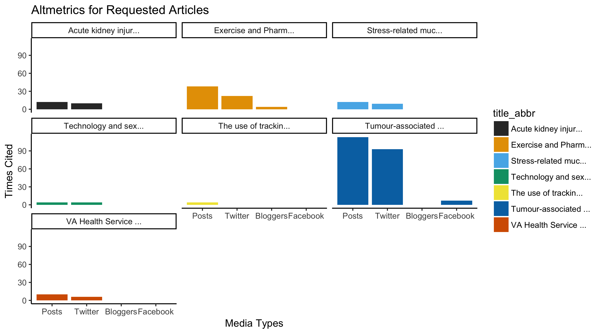

## R Script for Getting Altmetrics Data for Multiple Scholarly Articles
*Project by Alison Blaine, Erica Hayes, and Markus Wust*

This R script enables researchers to examine and compare altmetrics data on multiple scholarly articles and create a visualization of the results. 

This script can be used for getting the data, pre-processing and visualizing data on how often the article is cited in various social media outlets (Twitter, Facebook, Blogs, News Articles and more general "Posts").

This code uses the rAltmetrics package which pulls data from the Altmetic.com API for specified article DOIs. The Altemtrics.com API and more information about it can be accessed at [ https://www.altmetric.com/](https://www.altmetric.com/). 

#### How to Structure Your Data
A sample dataset has been provided that is a CSV file with a list of DOIs. If you have a list of DOIs that you want to compare altmetrics on, you can simply edit the CSV file to include those DOIs and re-run the script. The DOIs should be in one column with a column header of "doi". 

#### How to Run this Script

* First check out the [R session info](../sessioninfo.txt) file to see what versions of the software you will need to run this code. 
* Make sure you have R installed (and we also recommend RStudio in addition to R)
* Download or clone this repository to a folder on your computer. 
* Open RStudio and in your Files tab, navigate to the folder. 
* Click More, and Set as Working Directory
* Open activity.R file
* We'd suggest that you run the file line-by line to see how it works. Read the comments to better understand what the code is doing. The comments are in green text.
* If you want to run all the code at once, click the Source button.

#### Graph output

Your final graph should be useful for comparing the altmetric data on multiple articles at once. Here's what the output looks like using the sample data in doi_list.csv:

